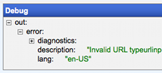

# Editor

A visual editor to combine simple functions with the help of "boxes" and "wires". This is the <i>controller</i> part of your application.

## input module

The input module adds a new entry to your wiring parameters. Each input module defines a form field using the inputEx library.

## output module

Output modules represent the returned values of your wiring. A wiring can have multiple output modules.

## Debug mode

Press the "Debug" button to execute the wiring.

	
Included debugger !

Clicking on different modules let's you inspect the return values of each sub-modules.

## Compose (Alpha)

A wiring properly created contains input and output modules.

The form is automatically created by aggregating the input modules fields into a single form.

Output terminals are created according to output modules in your original wiring.

