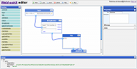

# Welcome

WebHookIt provides a visual programming paradigm to create simple webservices, mashups, web application integrations, composability between webservices, event-driven web programming, ... in short *program the web*.

WebHookIt is an open-source project, released under [MIT license](http://neyric.github.com/webhookit/license.txt).

A [limited hosted demo](http://webhookit.no.de) is hosted on Joyent

## Features / Design goals

 * [Visual Editor](editor.html)
 * [cron-based execution](cron-jobs.html)
 * [RESTful API](api.html)
   * execute it through a simple HTTP request   
   * call wirings through a web page with a form to enter the parameters
   * public execution of wirings through HTTP calls
   * easy integration
   * execution from an email through [MailHooks](tutorial-mailhooks.html)
 * extensible
   * [add custom modules](custom-modules.html)
   * connect to any web service
 * Asynchronous
 * Lightweight
 * [100% javascript](stack.html)

 
## Use cases

 * dead simple webservices
 * widgets for a website
 * create Mashups
 * [Webhooks](http://www.webhooks.org/) listeners
   * _Notifications_  *I wish I could get notifications exactly how I want*
   * _data synching_ *I wish my web apps would keep overlapping data in sync*
   * _chaining_ *I wish I could make another app do something  when I use this app.*
   * _modification_ *I wish I could make this app work just slightly differently.*
   * _plugins_ *I wish I could let my users extend/build plugins for my app.*
 

### How we are different from Yahoo! Pipes ?

First, we do not want to be a clone of [Yahoo! Pipes](http://pipes.yahoo.com/). Surely, the interface was the inspiration, but the scope of WebHookIt is much broader. The main reason of this project is to have deeper control over every part of the system.

WebHookIt sits in middle of Yahoo! Pipes and services like [Scriptlets](http://www.scriptlets.org/), [Notify.io](http://www.notify.io/), or [Tarpipe](http://tarpipe.com)

  * no run limitations
  * control cache policies
  * built-in cron system to call pipes on demand
  * better RESTful integration
  * customizable 
  * integrate with your private systems
  * interacting with the web of objects
  * run system commands
  * code modules in ruby, python etc... 
  * access to filesystem
  
Of course, we lose some features :

  * Not a hosted service : but it is quite easy to install freely on [Joyent](install_joyent.html)
  * Social aspect : We plan to provide a community packet manager to share wirings in the future
  
## Help

WebHookIt is still *alpha*. If you wish to support this project, you can Donate below.

Donations will be used for development, maintenance and promotion of this project.

