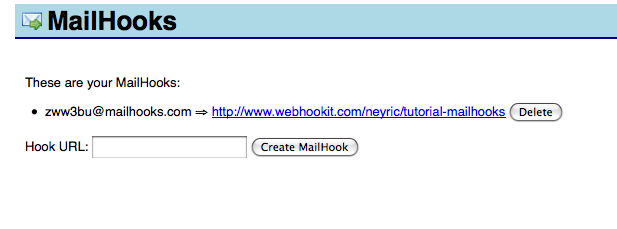

# How to connect a MailHook

<a href="http://www.mailhooks.com/">MailHooks</a> lets you receive emails via HTTP POST (aka webhooks). You can create many hooks that will give you an email address @mailhooks.com that when emailed, the contents will be parsed and posted to the URL you specify as if it was a form post.

