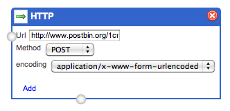

# Using PostBin to prepare your HTTP requests

[Postbin](http://www.postbin.org/) is a web service to log HTTP POST requests.

Just go to the website, and click the "make a PostBin" button. You will get an URL like http://www.postbin.org/1cxpp1l

In the Editor, create a new wiring, add an HTTP module to the canvas, and configure it like so :

Now hit the "Debug" button. Refresh your postbin page, and you should see the request !

